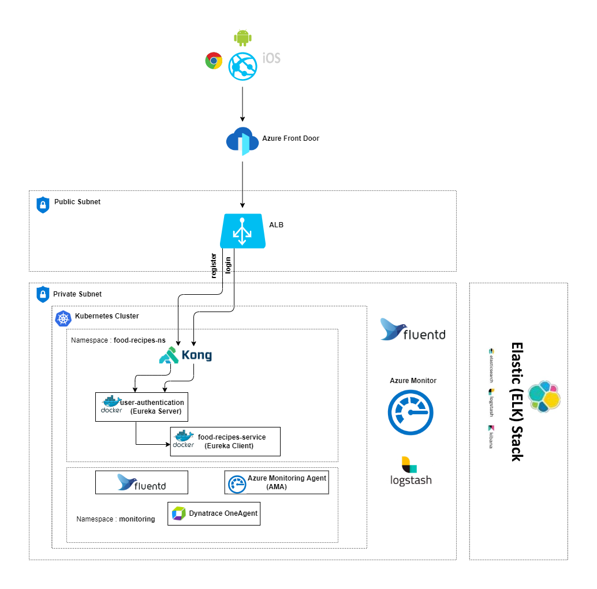

# Food Recipes App API

## Description
Micro Services to display the Food Recipes APP. This service is having two micro services
* user-authentication
* food-recipes-service
User authentication API allows users to register new user, login user and logout

Food recipes service API allows users to manage your favourite recipes.
These API’s  show all available recipes and the actions to create, update and delete a recipe.

This app is created on basis of JWT and Eureka. Here you can create username and password via user registration api .
Then the jwt token will be  supplied by the api, this token is used in recipes API

## Architecture Diagram


## Requirements

* [Java](https://www.oracle.com/java/)
* [Maven](https://maven.apache.org/)
* [Spring Boot](https://spring.io/projects/spring-boot)
* [jUnit](https://junit.org/)
* [mockito](https://site.mockito.org/)
* [Docker](https://www.docker.com/)
* [Docker](https://www.docker.com/)


## Steps to build
 - Clone the repository
 - go to parent folder
 - cd food-recipes-service then do the below steps and
 - repeat the same steps by going to the folder user-authentication by using cd user-authentication

## Installation

Use the maven command line interface [Maven](https://maven.apache.org/) to install the dependencies

```bash
mvn install -DskipTests=true
```
## package test 
```bash
mvn test 
```
## package build 
```bash
mvn package 
```
## Docker build

 - after the completeing the above steps for both food-recipes-service and user-authentication go back to food-recipes-app folder using cd ..
 - then run the below command
```bash
docker-compose up --build -d
```

### How the docker image is build

* Base image for the docker container is `openjdk:11-jdk`

* Compiled class files under `target/food-recipes-service-1.0.1.0-SNAPSHOT.jar ` are copied to `webapp.jar` in the image

* Base image for the docker container is `openjdk:11-jdk`

* Compiled class files under `target/user-authentication-1.0.1.0-SNAPSHOT.jar ` are copied to `webapp.jar` in the image


## Health Check

+ 
    - path : /user-authentication/health
    - port : 8761
+ 
    - path : /food-recipes-service/health
    - port : 9091
    
## Running the application with IDE

There are several ways to run a Spring Boot application on your local machine. One way is to execute the `main` method in the `Application` class from your IDE.

* 	Download the zip or clone the Git repository.
* 	Unzip the zip file (if you downloaded one)
* 	On Command Prompt and Change directory (cd) to folder containing pom.xml
* 	On Eclipse
    * File -> Import -> Existing Maven Project -> Navigate to the folder where you unzipped the zip
    * Select the project
* 	On Intleji
    * File->Open -> Navigate to the folder where you unzipped the zip
    * Select the project
* 	Choose the Spring Boot Application file (search for @SpringBootApplication)
* 	Right Click on the file and Run as Java Application.
* 	Do above steps for user-authentication and food-recipes-service one by one.

    
## Data Contract

+ 
    - path for user-authentication : user-authentication/food-recipes-open-api.yaml
    - path for food-recipes-service : food-recipes-service/user-authentication-open-api.yaml
    - open  [swaggerEditor](https://editor.swagger.io) then paste the contents in opeapi.yaml
    
 ## API collection
- got to directory ./postman-collection. Here you can see the postman collection.

## Swagger url

  *  [SWAGGER for user-authentication ](http://localhost:8761/swagger-ui/index.html#/user-controller)
  *  [SWAGGER for food-recipes-service](http://localhost:9091/swagger-ui/index.html)
  


